# Hunt Design Lab

**Hunt Design Lab** (**HuntDL**) is a **Node.js 2D MMO engine** and an HTML / JavaScript toolkit for **dungeon combat simulation**, **content design**, and a multi-genre **creature concept → spritesheet** pipeline.

<p align="center">
  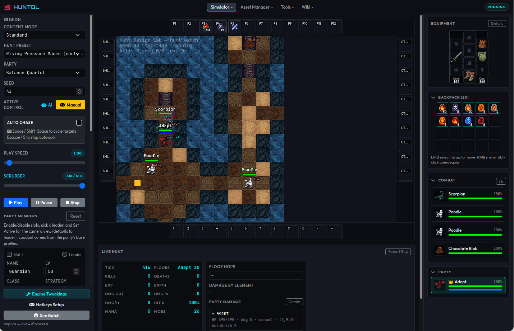
</p>

| | |
| :--- | :--- |
| **Product** | Hunt Design Lab |
| **Short** | HuntDL |
| **Package / repo** | `hunt-design-lab` |
| **Mark** | Red `fa-dragon` (nav) + `assets/brand/favicon.svg` |

Shared game logic lives under `kernel/` and runs in **Node** (headless / server-shaped) and in the **browser** (watch UI). CLI tools live under `bin/`. A PHP shell hosts the web apps. Sprite green-screen / quantize steps use Python (`bin/process_sprites.py`).

> **Status:** early public-ready snapshot (`0.7.0`). APIs, presets, and art pipelines may still change.

## Engine and architecture

One goal of this repo is a **tile-based 2D MMO engine in Node.js** — not only a combat lab. The current stack is already shaped for a **client–server** split, even while the “server” and the “client” still share a process in the designer apps:

| Piece | Role today | MMO-shaped meaning |
| :--- | :--- | :--- |
| **`kernel/` Simulator** | Authoritative world tick (fixed **20 Hz** logic). Combat, movement, occupancy, pathfinding, stairs, fields, NPC talk, and inventory all land here. | Game server |
| **Command queue** | The UI never mutates the world directly. Clicks, hotkeys, talk replies, and item use enqueue commands (`SET_TARGET`, `CUSTOM_COMMAND`, move, use, …) that the Simulator applies on the next logic tick. | Client → server messages |
| **Browser Hunt / Scenario Lab** | Camera, HUD, action bars, dialog panel, mouse dispatcher. Reads session state and paints; does not own rules. | Game client |
| **Headless runner** | Same Simulator, no DOM / images. Batch hunts, sweeps, and bug repro use the identical tick. | Dedicated / CI server |
| **Presets** | Classes, spells, creatures, hunts, dialogs, maps — JSON packs loaded by both sides. | Shared content |

Creature pathfinding, combat resolution, and NPC dialog stay on the simulation side. A future network client can send the same command types the local UI already queues. Logic `dt` is fixed; wall-clock speed only changes how often ticks are scheduled, not the rules.

## Features

- **2D MMO kernel (Node.js)** — tile maps, A\* / navmesh, multi-floor stairs, occupancy and player stacking, classes / spells / equipment, status conditions, elemental fields, inventory, and a command-driven session
- **Hunt simulator** — deterministic party vs. dungeon runs with live watch UI, tick scrubber, manual control, action bars, and debug overlays
- **Headless simulation** — batch hunts, balance sweeps, strategy evaluation, telemetry summaries
- **Map editor** — paint multi-floor tilemaps (ground / path / scenery / furniture / stairs), collision, sight, flags, fields, and creature spawns; save hybrid map packs the engine can load
- **NPCs** — talkable creatures with dialog trees, walk-then-talk, a floating reply panel, hunt-scoped storage, give/take, vendor-lite shops, and idle wander / voices
- **Designer / content tools** — hunt packs, dungeon profiles, piece grids, wiki browsers, Scenario Lab fixtures
- **Sprite pipeline** — commercial-safe name banks → AI image gen (Google Antigravity or Grok Build) → ImageMagick split → Pillow variants (`alpha` / `medium` / `retro` / `small` / `icon`)
- **Free Edit (optional)** — Sprite Manager pen button opens [Sprite Editor](https://github.com/haeretici/sprite-editor) free-edit mode to paint/fix cutouts; Save replaces `original/` and reprocesses variants
- **Content modes** — `standard` (shipped product pack) and `legacy` (reference pack on a separate git branch). Packs do not fall back into each other.
- **Multi-genre catalogs** — fantasy, ecology, ultra-tech, space, steampunk, super-heroes

UI captures live under [`assets/screenshots/`](assets/screenshots/) — see **Screenshots** below.

## Requirements

| Tool | Notes |
| :--- | :--- |
| **Node.js** | ≥ 18 |
| **PHP** | Built-in server for web UI (`npm run dev`) |
| **Python 3** | Sprite processing (`Pillow` recommended for `process_sprites.py`) |
| **ImageMagick** | `magick` CLI for 4×4 sheet splits (sprite pipeline only) |
| **npm** | Install deps with `npm install` |

Optional (image generation only): [Google Antigravity](https://antigravity.google/) (`agy`) and/or [Grok Build](https://x.ai/) (`grok`) CLIs, plus whatever accounts / terms those products require.

Optional (pixel Free Edit from Sprite Manager): [Sprite Editor](https://github.com/haeretici/sprite-editor) — see **Integrating Sprite Editor** below.

## Quick start

```bash
npm install
npm run build                  # assets build + process:all
bash scripts/regen-tiles.sh    # regen tiles with opaque bg
npm run dev            # PHP server on 127.0.0.1:8080
```

Then open:

| App | URL | Screenshot |
| :--- | :--- | :--- |
| Hunt Simulator | http://127.0.0.1:8080/ | [hunt-simulator](assets/screenshots/hunt-simulator.png) |
| Scenario Lab | http://127.0.0.1:8080/scenario-lab.php | [scenario-lab](assets/screenshots/scenario-lab.png) |
| Simulation Analysis | http://127.0.0.1:8080/simulation-analysis.php | [simulation-analysis](assets/screenshots/simulation-analysis.png) |
| Sprite Manager | http://127.0.0.1:8080/sprite-manager.php | [sprite-manager](assets/screenshots/sprite-manager.png) |
| Sprite Batch Builder | http://127.0.0.1:8080/sprite-batch-builder.php | [sprite-batch-builder](assets/screenshots/sprite-batch-builder.png) |
| Hunt Editor | http://127.0.0.1:8080/hunt-editor.php | [hunt-editor](assets/screenshots/hunt-editor.png) |
| Designer UI | http://127.0.0.1:8080/designer-ui.php | [designer-editor](assets/screenshots/designer-editor.png) |
| Sim Batch Builder | http://127.0.0.1:8080/sim-batch-builder.php | [sim-batch-builder](assets/screenshots/sim-batch-builder.png) |
| Wiki (creatures) | http://127.0.0.1:8080/wiki-creatures.php | [wiki-creatures](assets/screenshots/wiki-creatures.png) |
| Wiki (equipment) | http://127.0.0.1:8080/wiki-equipment.php | [wiki-equipment](assets/screenshots/wiki-equipment.png) |
| Wiki (spells) | http://127.0.0.1:8080/wiki-spells.php | — |
| Map Editor (Legacy Map) | http://127.0.0.1:8080/wiki-legacy-map.php | — |

```bash
# Tests + a headless hunt
npm test
npm run sim:hunt

# Creature names (stdout only; commercial-safe vocabulary filters)
node bin/generate_creature_names.js -g rpg_fantasy

# Sprite batch dry-run (no image-gen call)
node bin/generate_sprite.js --genre steampunk --dry-run
```

The web UI also works under a **subfolder** (e.g. parent docroot + `/hunt-design-lab/`, or a private checkout folder name). CSS/JS/API URLs are prefixed from `SCRIPT_NAME`. Override with env `HDL_APP_ROOT` if needed.

## Screenshots

UI captures are stored in [`assets/screenshots/`](assets/screenshots/). Below is a tour of the main web apps.

### Hunt Simulator

Live party vs. dungeon watch mode: pick a hunt preset and party, scrub ticks, and inspect combat telemetry. Manual control uses the same command queue as a future network client — move, target, cast, talk, and use items from the canvas and action bars.


**Engine Tweakings** (popup from the hunt sidebar) — camera zoom, transport, and AI debug overlays (paths, ranges, hit sources, tile types).

<p align="center">
  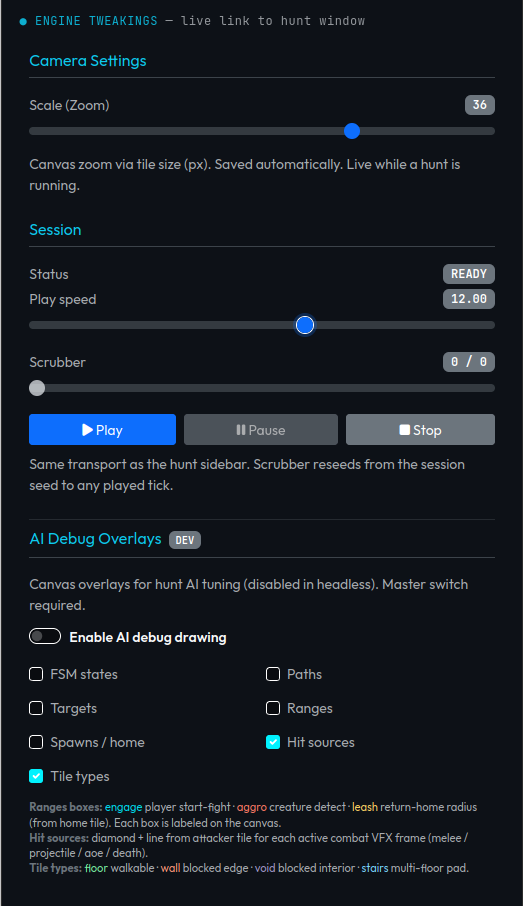
</p>

**Action Bars & General Hotkeys** (configuration popups for manual control mode) — bind spells, runes, items, and macro commands to custom docks with per-vocation profiles, smart casting, and live cooldown overlays, or configure general movement and targeting shortcuts.

| Action Bars Configuration | General Hotkeys |
| :---: | :---: |
| 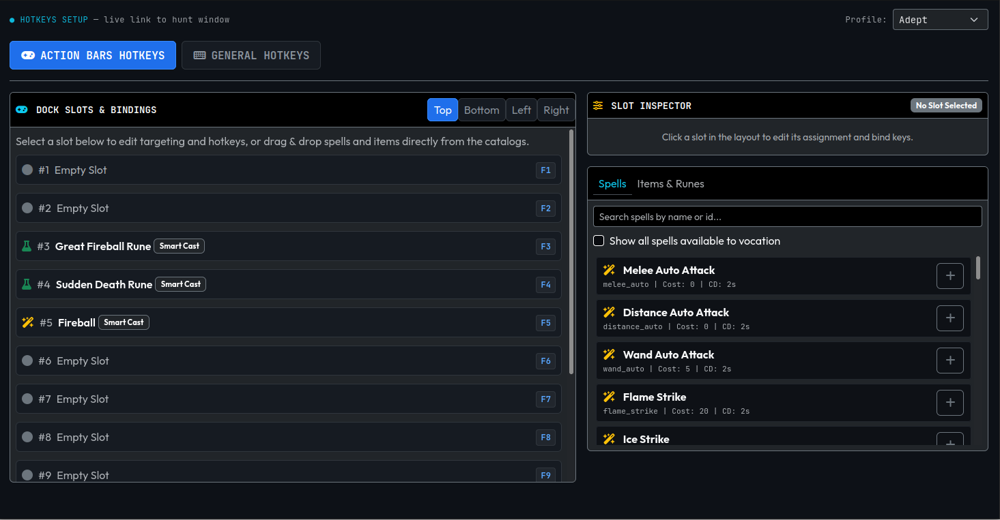 | 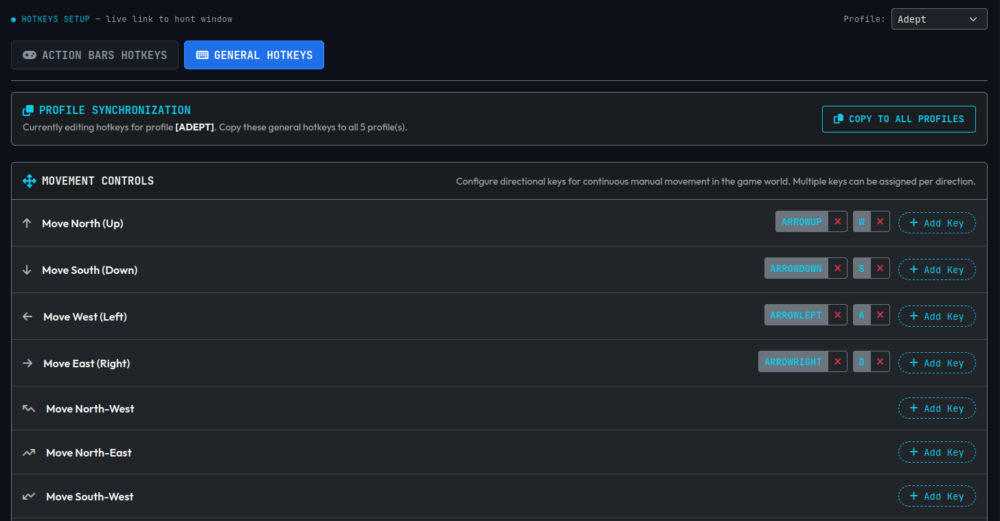 |

Mouse control modes (Classic, Regular, Smart left-click) map clicks to talk / attack / use / autowalk the way a 2D MMO client would. The HUD also covers equipment, backpack, combat roster, skills, and party.

### Scenario Lab

Isolated fixtures for choke points, leash tests, NPC talk, and golden product hunts — same watch canvas without full dungeon generation.

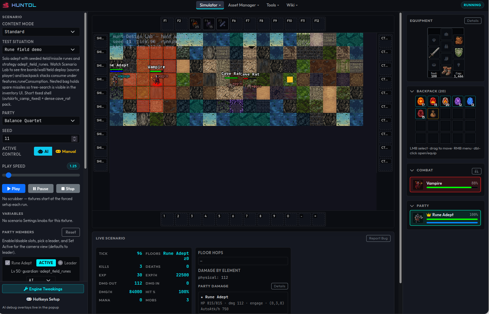

### Simulation Analysis

Browse headless batch / sweep results: class viability charts, balance knobs, import JSON, open Sim Batch from the sidebar.

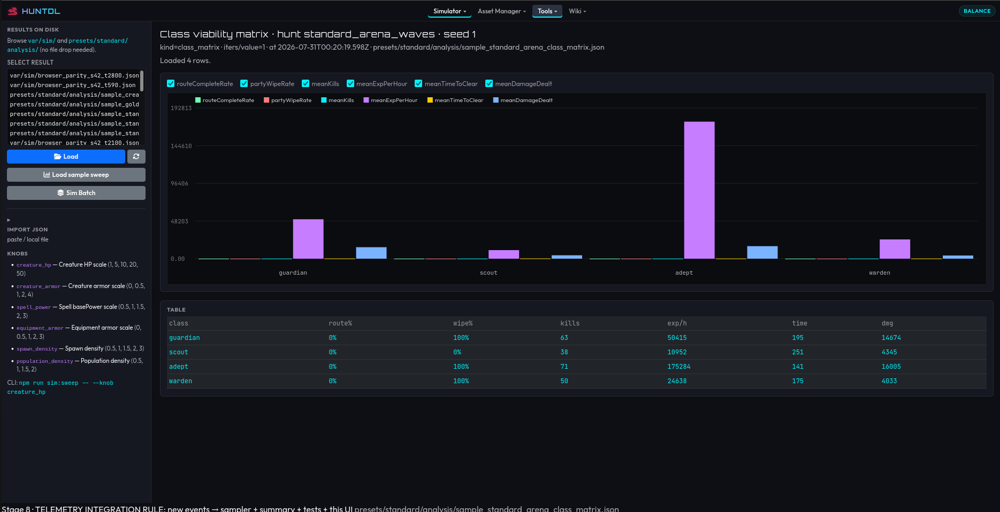

### Sim Batch Builder

Plan multi-iteration headless hunt batches (hunt id, seeds, concurrency) and hand off to the job runner.

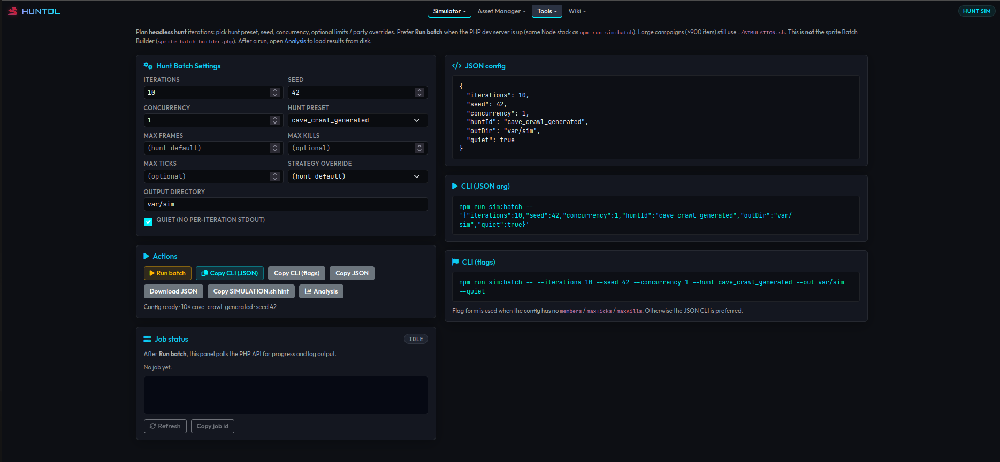

### Sprite Manager

Multi-genre creature catalog: alpha thumbs, Fix Green / Flip / Regen / Delete, and Free Edit (pen) when [Sprite Editor](https://github.com/haeretici/sprite-editor) is integrated.

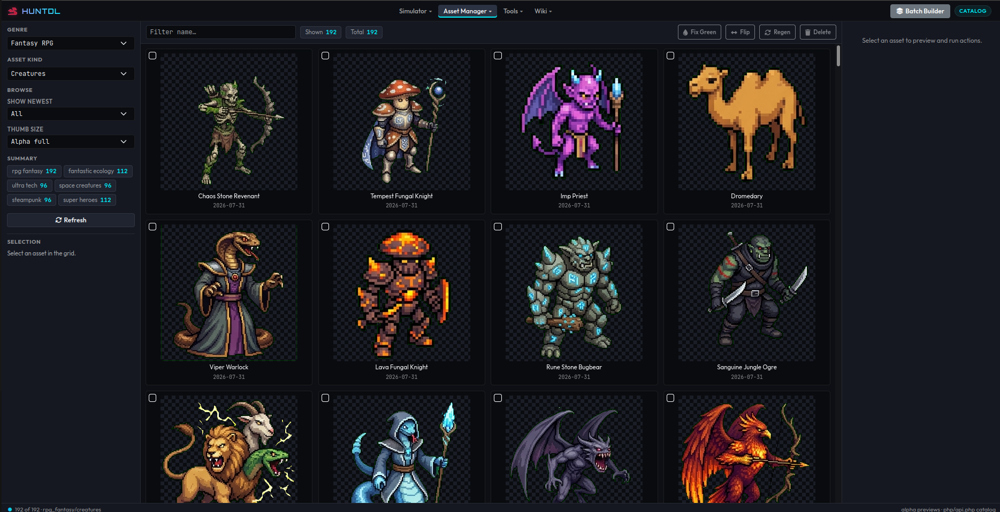

### Sprite Batch Builder

Plan AI sprite batches (genre, model, seed, iterations) and run image-gen jobs from the web UI or CLI.

<p align="center">
  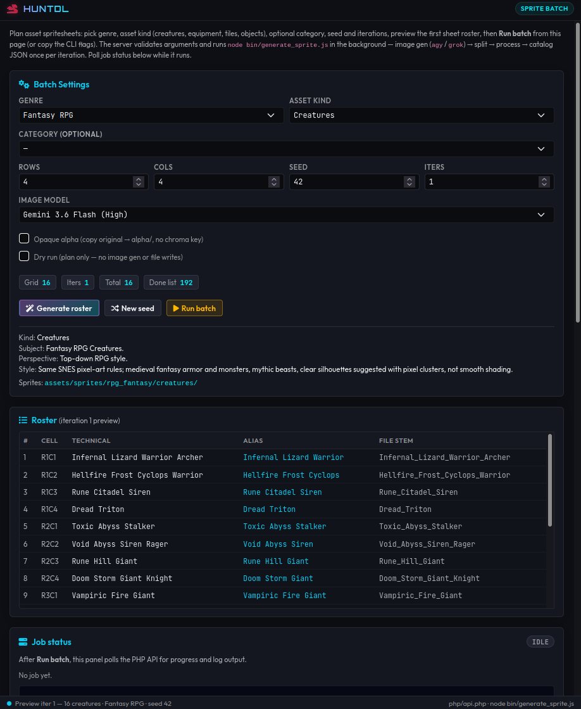
</p>

### Hunt Editor

Author hunt packs: layout / dungeon profile, waves, regions, and party hooks for the simulator.

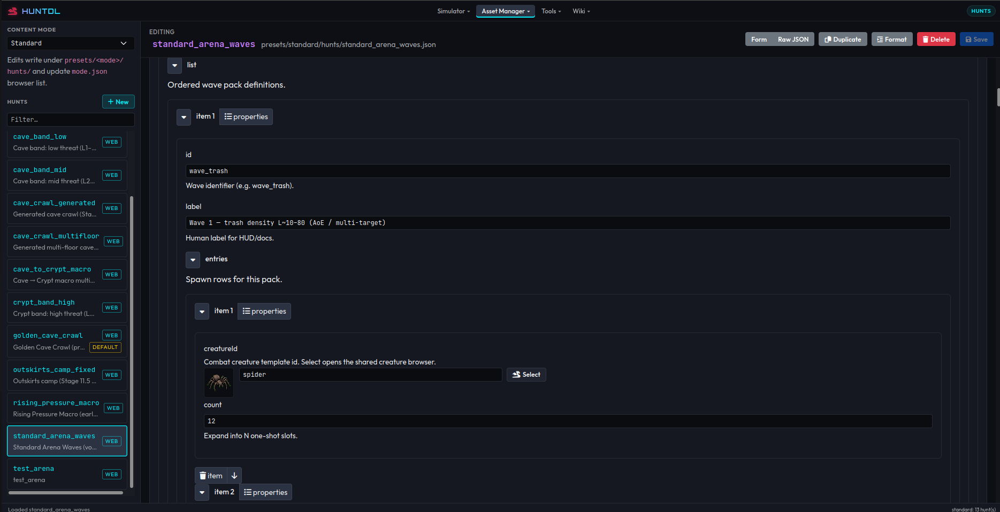

### Designer UI

Mode-scoped content CRUD (spells, classes, equipment, biomes, pieces, …) with shape pickers and raw JSON.

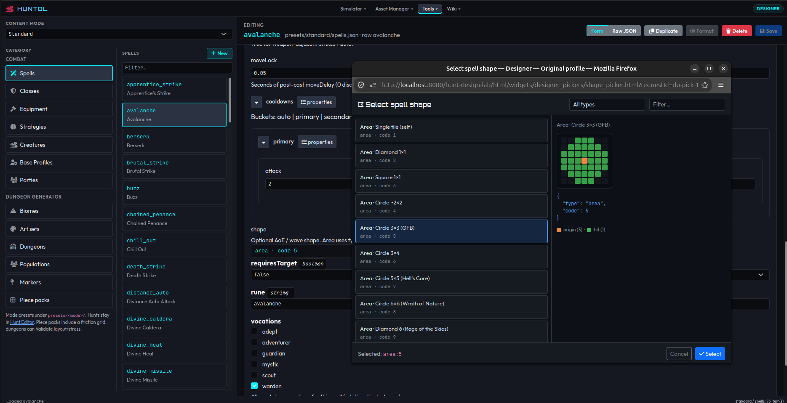

### Wiki

Read-only browsers for the creature, equipment, and spell catalogs.

| Creatures | Equipment |
| :---: | :---: |
| 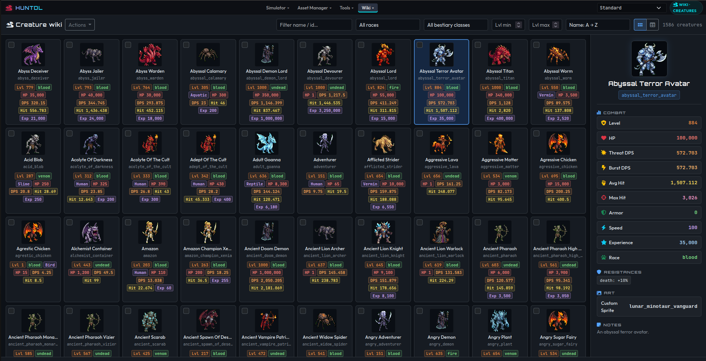 | 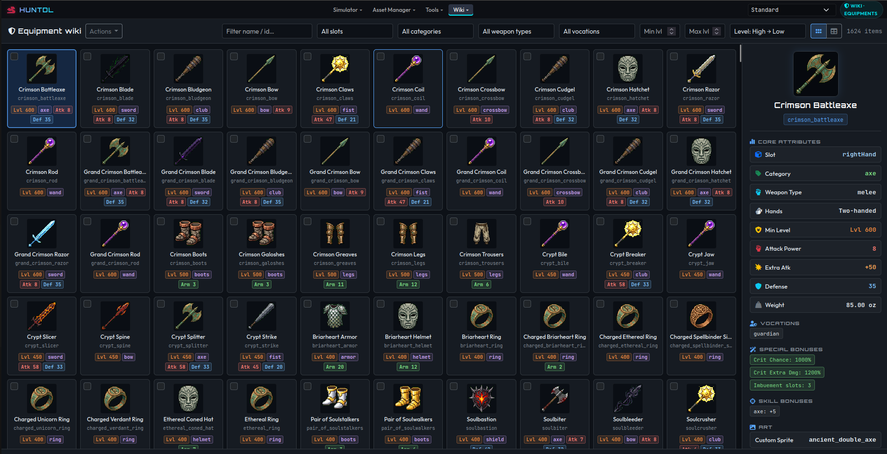 |

### Map editor

**Wiki → Legacy Map** (`wiki-legacy-map.php`) is a full tilemap editor, not only a viewer. Designers paint gameplay layers that the Simulator bakes into walk / sight / flag arrays at runtime.

| | |
| :--- | :--- |
| **Floors** | Sixteen stacked floors (`00`–`15`). Stairs, ladders, and holes are one-way hops unless a return pad is stamped. |
| **TileMap stack** | Top → bottom: **vertical** (stairs / ladder / hole / rope / shovel), **furniture**, **scenery**, **path**, **ground**. |
| **Gameplay overlays** | **Fields** (fire / poison / energy / obstacles), **Flags** (no-cast, protection, no-creature, …), **Sight**, **Friction** (step delay vs blocked). |
| **Spawns** | Place and filter creature / NPC spawns on the current floor. |
| **Tools** | Select, pen, bucket, pan; square / circle / diamond / cross / dither / spray brushes; sizes 1×1–9×9; grid; undo / redo; zoom 100%–3200%. |
| **Icons** | At high zoom the editor overpaints catalog tile / object sprites (32×32) instead of role colors. |
| **Save** | **Save Map** writes a hybrid pack (`map.json` + gzipped layer blobs). **Export PNG** dumps the friction channel. `Ctrl+S` saves. |

Hunts prefer a hybrid pack when present. Procedural dungeons emit the same baked arrays in memory, so authored rooms and generated caves share one collision model.

### NPCs and dialog

Talkable NPCs are ordinary creatures with NPC identity (`isNpc`, `kind: "npc"`, or `flags.talkable`) and **no** hostile / attackable-NPC flags. They do not aggro, grant exp, or drop loot. The player AI will not pick them as combat targets.

| | |
| :--- | :--- |
| **Start talk** | Classic: unshifted right-click. Smart left-click: unshifted left-click. Out of range walks to an adjacent tile first (same floor, Chebyshev distance ≤ **3**). |
| **Dialog UI** | Floating panel next to inventory: NPC name, node text, reply buttons, close (`Escape`, click-outside, or **Bye**). |
| **Trees** | Inline `dialog` on the creature, or a `dialogId` file under `presets/<mode>/dialogs/`. Replies `goto` a node, `close`, `open_shop`, `give_item` / `take_item`, or enqueue another command. |
| **Simple quests** | Reply / node `when` and `set` read and write `player.storage` (hunt-scoped key/value; unset keys are `0`). |
| **Give / take** | Replies can grant or consume backpack items (all-or-nothing; fail prints an FCT). |
| **Shop** | Vendor-lite buy/sell vs backpack (`shop` on the creature). Currency is an item (`gold_coin` by default). No bank or coin conversion. |
| **Wander / voices** | Optional idle walk in a Chebyshev box around home, plus periodic voice lines, only when a spectator is nearby. Talk freezes walk. |
| **Try it** | Scenario Lab fixture **`npc_talk_lab`**, sample NPC **`town_guide`**. |

Free-text chat, quest journals, banks, and depots are **not** in this snapshot. Missing dialog prints **“Nothing to say.”** Hostile creatures never talk.

## Integrating Sprite Editor

[Sprite Editor](https://github.com/haeretici/sprite-editor) is a **separate** modular compositor / part-rig editor (paperdoll parts, animation frames, palettes, spritesheets). Hunt Design Lab does **not** vendor it; the Sprite Manager **Free Edit** (pen) button opens the editor’s free-edit page as a same-origin popup.

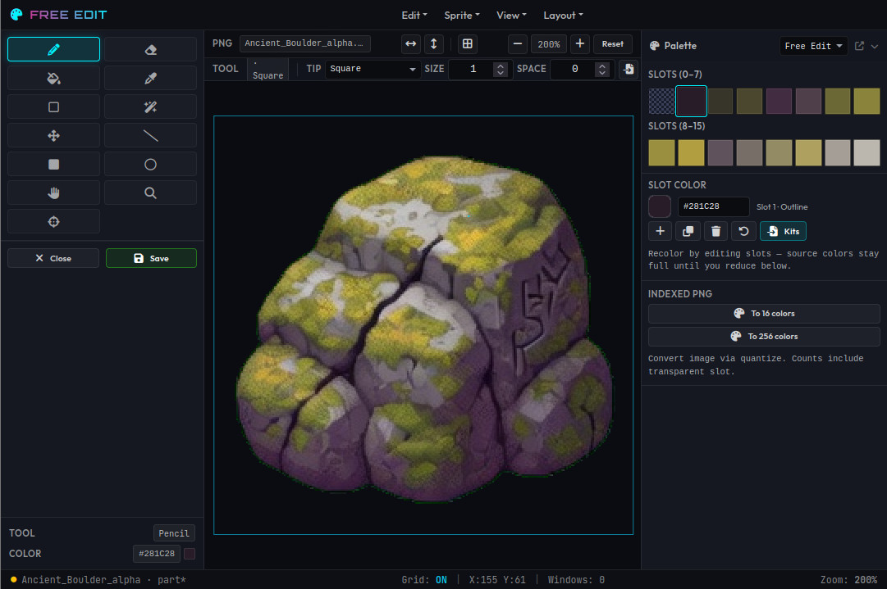

| Piece | Role |
| :--- | :--- |
| **Standalone Sprite Editor** | Full paperdoll / rig / sheet tooling (`index.html`, etc.) |
| **Free Edit** (`layout_free_edit.html`) | Paint a single PNG cutout; used by Sprite Manager |
| **HuntDL default base URL** | `SPRITE_EDITOR_URL` in `kernel/settings.js` → **`/sprite-editor`** |

### Why same origin?

Free Edit talks to Sprite Manager with `window.postMessage` and **requires the same browser origin** (scheme + host + port). Messages:

1. Child → parent: `FREE_EDIT_READY`
2. Parent → child: `FREE_EDIT_LOAD` (`pngBase64` of the creature **alpha** PNG)
3. Child → parent: `FREE_EDIT_SAVE` (edited PNG) or `FREE_EDIT_CANCEL`

On Save, Sprite Manager runs the same path as **Replace original** (`creature_replace` → `process_sprites.py --force --only STEM`).

Running Sprite Editor only on its own `npm run dev` port (**8090**) while HuntDL is on **8080** is fine for standalone editing, but **Free Edit from Sprite Manager will not work** across origins.

### Setup (recommended for local `npm run dev`)

Clone next to this repo (or anywhere you prefer), build, then expose it at **`/sprite-editor`** on the same host/port as HuntDL. The simplest local pattern is a symlink into the project root so PHP’s built-in server can serve both trees:

```bash
# Sibling checkout (example layout)
#   parent/
#     hunt-design-lab/   # this repo
#     sprite-editor/     # https://github.com/haeretici/sprite-editor

cd ..   # parent of this repo
git clone https://github.com/haeretici/sprite-editor.git
cd sprite-editor
npm install
npm run build

# Back in Hunt Design Lab: serve editor at /sprite-editor/...
cd ../hunt-design-lab   # or dungeon-engine / your checkout name
ln -sfn ../sprite-editor sprite-editor

npm run dev
```

Then:

| App | URL |
| :--- | :--- |
| Hunt Design Lab | http://127.0.0.1:8080/ |
| Sprite Manager | http://127.0.0.1:8080/sprite-manager.php |
| Free Edit (opened by pen) | http://127.0.0.1:8080/sprite-editor/layout_free_edit.html |
| Full Sprite Editor shell | http://127.0.0.1:8080/sprite-editor/ |

The repo’s `.gitignore` already ignores a local `sprite-editor/` path (symlink or nested clone).

### Production / multi-app docroot

If you already serve several apps under one site root, install Sprite Editor so its public path is **`/sprite-editor/`** (or change the base URL below):

```text
docroot/
  hunt-design-lab/     # or mount HuntDL at /
  sprite-editor/       # built (npm run build); index.html + build/shell.bundle.js
```

Apache/nginx should serve both from the **same origin**. Subfolder deploys are supported by Sprite Editor (relative assets via `<base href>`).

### Custom base URL

Default in `kernel/settings.js`:

```js
const SPRITE_EDITOR_URL = '/sprite-editor';
// → opens /sprite-editor/layout_free_edit.html
```

Supported forms (see `resolveSpriteEditorUrl`):

| Form | Example | Opens |
| :--- | :--- | :--- |
| Absolute path | `/sprite-editor` | `/sprite-editor/layout_free_edit.html` |
| Absolute URL | `https://tools.example.com/sprite-editor/` | same origin only for Free Edit protocol |
| App-relative | `tools/sprite-editor/` | resolved via HuntDL `appUrl` |

After changing `SPRITE_EDITOR_URL`, rebuild the browser bundle (`npm run build:js` or `npm run build`).

### Standalone Sprite Editor (no HuntDL)

```bash
cd sprite-editor
npm install && npm run build
npm run dev    # http://localhost:8090/
```

Use this for paperdolls, rigs, and sheets. Export PNG / game packs from the editor; drop results into HuntDL’s sprite pipeline (`original/` + `process_sprites.py`) when you want engine variants.

### Workflow from Sprite Manager

1. Start HuntDL with Sprite Editor available at the configured base (`/sprite-editor` by default).
2. Open **Sprite Manager** → select a creature → click the **pen** (Free Edit).
3. Edit the alpha cutout; **Save** posts PNG back → `original/` overwrite + variant reprocess.
4. **Close** cancels without writing.

If the popup shows a blank page or Save never lands, check that `/sprite-editor/layout_free_edit.html` loads on the **same** host/port as Sprite Manager and that `npm run build` was run inside the Sprite Editor checkout.

## Genres

| Id | Content |
| :--- | :--- |
| `rpg_fantasy` | Classic fantasy RPG creatures |
| `fantastic_ecology` | Elemental / ecosystem monsters |
| `ultra_tech` | Robots and mecha |
| `space_creatures` | Aliens and cosmic fauna |
| `steampunk` | Clockwork and brass automatons |
| `super_heroes` | Original heroes / villains (no franchise names) |

- Sprites: `assets/sprites/<genre>/<kind>/{original,alpha,medium,retro,small,icon}/`
- Done lists: `assets/data/<genre>/creature_list_done.txt` (and related lists)
- Catalogs: `assets/data/<genre>/creatures.json` (and related JSON)

## Project layout (short)

```text
kernel/               # Shared JS: combat, AI, dungeon gen, telemetry, map editor, NPC talk, apps
bin/                  # Thin CLI entry points
php/                  # JSON API + job runner
presets/              # Content modes (standard, and legacy on its branch)
assets/sprites/       # Multi-genre art tree (often AI-generated)
assets/screenshots/   # README UI captures
assets/legacy/        # Public: reference data + one auto-generated map image (illustrative)
tests/                # Node test suite
```

## License

**Source code and project documentation** in this repository are licensed under the [MIT License](LICENSE) unless a file says otherwise.

```
Copyright (c) 2026 Thiago Campos Viana
```

### What MIT covers

MIT applies to the **software** you can reasonably treat as authored project code and docs, for example:

- `kernel/`, `bin/`, `php/`, `scripts/`, `scss/`, `templates/`, `html/`, `tests/`
- Build entry points (`app.js`, `build-*.mjs`, package scripts)
- JSON **schemas** under `schemas/`
- This README and other authored project Markdown

### What MIT does **not** automatically cover

Third-party terms, unclear copyright status of model outputs, and reference data mean the following are **not** redistributed under a simple “everything is MIT” promise:

| Material | Location (typical) | Notes |
| :--- | :--- | :--- |
| **AI-generated sprites & sheets** | `assets/sprites/**` | Produced with Google Antigravity (`agy`) and/or Grok Build (`grok` / Imagine-style tools). See **AI-generated media** below. |
| **Legacy reference pack (public)** | `assets/legacy/**` | Distributed with **reference data only** (maps/bounds/navmesh JSON, spawn tables, notes) plus **one automatically generated** path-map image for illustration (`map/floor-07-path.png`). **Not** a commercial art pack. |
| **Legacy monster art** | `assets/legacy/monsters/` | Removed. Do not re-add GIFs or `manifest.json` here. |
| **Derived combat / content packs** | parts of `presets/**`, `assets/data/**` | May mix original design with ports or AI-assisted labels. Review before shipping a product. |
| **Vendor / install trees** | `node_modules/`, etc. | Their own licenses. |

If you ship a product from this repo, **replace or re-license art deliberately**. Do not assume open-source code rights extend to every binary under `assets/`. The public `assets/legacy/` tree is fixture/reference data and one auto-generated map image—not redistributable third-party creature art.

---

## AI-generated media (important)

Much of the art under `assets/sprites/` was created with **third-party generative tools**, primarily:

- **[Google Antigravity](https://antigravity.google/)** (`agy` CLI; Gemini-family image models)
- **[Grok Build](https://x.ai/)** / xAI tooling (`grok` CLI; image generation via the product’s imaging stack)

### Disclaimers (read before commercial use)

1. **No warranty of ownership or exclusivity.** Purely machine-generated images may have limited or no copyright protection in some jurisdictions, and providers may generate similar outputs for others. This project does **not** warrant that any sprite is uniquely yours or free of third-party claims.
2. **Provider terms control.** Your rights to generate, keep, modify, and redistribute those images depend on the **current** Terms of Service, acceptable-use policies, and product-specific rules of Google, xAI, and any intermediate tooling—not on this repo’s MIT license. Those terms change; check them yourself.
3. **Not legal advice.** Nothing in this README is legal advice. If you need certainty for a commercial game, app store listing, or publisher deal, consult a qualified attorney and your own counsel on AI-output and IP clearance.
4. **Commercial shipping is your risk.** Name banks aim to avoid well-known franchise and tabletop Product Identity strings, but filters are **heuristic**, not a clearance search. Review every batch before release.
5. **Attribution of tools is not endorsement.** Mentions of Google, Antigravity, Gemini, xAI, Grok, or Imagine are for technical provenance only. Those names and products are trademarks of their owners.
6. **Downstream responsibility.** If you fork this repo and regenerate or commit new AI art, you are responsible for compliance with the tools you use and for what you distribute.

### Practical recommendations for forks / releases

- Prefer regenerating art under **your** accounts and documenting which provider/model produced each batch.
- Keep a private inventory of which stems came from which tool (provider, model label, date) if you need audit trails.
- Consider **excluding** large `assets/sprites/**` trees from a public release if you are unsure about redistribution, and point users at the sprite pipeline in this README instead.
- Public `assets/legacy/` is already limited to **reference JSON + one auto-generated illustrative map image**. Do not commit creature GIFs under `assets/legacy/monsters/`.
- Never claim that AI sprites are “MIT licensed” or “copyright-free”; say they are **generated media subject to third-party terms and local law**.

---

## Contributing / development notes

Hunt Design Lab is an independent **solo project** developed and maintained by Thiago Campos Viana. There are several great ways you can contribute to support and shape its development:

- **Join the YouTube Channel**: Subscribe to [tcviana on YouTube](https://www.youtube.com/tcviana) to follow development coding sessions, participate in discussions, share ideas, and make suggestions for new features or balance tweaks. Joining the channel and entering discussions is one of the primary ways to contribute directly to the project!
- **Donate to speed up dev**: Because this is a solo project, contributing via cryptocurrency donations in the **Support the Project (Crypto Donations)** section below helps offset costs and significantly speeds up ongoing development and tool pipelines.
- **Code notes**:
  - Shared logic belongs in `kernel/`; CLIs under `bin/` stay thin entry points.
  - Git-tracked JSON under `presets/` and `assets/data/` uses 4-space indent and a trailing newline (do not sort keys).
  - Resource-heavy image-gen and mass reprocess jobs should be intentional (cost + rate limits).

```bash
npm run build:css              # Sass only
npm run build:js               # esbuild only
npm run process:all            # Python sprite variants for all genres
npm run build                  # assets build + process:all
bash scripts/regen-tiles.sh    # regen tiles with opaque bg
```

## Disclaimer of warranty

THE SOFTWARE AND ANY BUNDLED OR REFERENCED ASSETS ARE PROVIDED “AS IS”, WITHOUT WARRANTY OF ANY KIND. THE AUTHORS ARE NOT LIABLE FOR CLAIMS ARISING FROM USE OF THE CODE, SIMULATIONS, OR MEDIA—INCLUDING IP, CONTRACT, OR REGULATORY DISPUTES RELATED TO AI-GENERATED CONTENT.

---

## 🌐 Connect with Me

Stay updated with my projects, coding sessions, and videos. Joining the YouTube channel is a fantastic way to actively contribute to the project by entering discussions, sharing feedback, and proposing new suggestions:

- **YouTube**: [tcviana](https://www.youtube.com/tcviana)
- **X (formerly Twitter)**: [@haeretici](https://x.com/haeretici)

---

## 💖 Support the Project (Crypto Donations)

Hunt Design Lab is an independent **solo project**. If you find this project useful and would like to contribute to its continued growth, you can support development by making a cryptocurrency donation to the addresses below. Your donations directly fund infrastructure and AI generation costs, significantly speeding up ongoing development!

* **BNB Chain / Ethereum / Polygon / OP / Linea / Base / Arbitrum (EVM)**:
  `0xfE5Fc67Fe92234cB079B521EC7f9ad9c23da2AA8`

* **Solana (SOL)**:
  `EjPqM1cX5nhkqdb7GK7z5aF9ayRswPUwPd5VnVP1PVVL`

* **Tron (TRX)**:
  `TP3Ncy8RVYKJPkVBbrrMD8WsDmPkRCLArG`

* **Bitcoin (BTC)**:
  `bc1qqk5s3rmvxe3mlhtzr07xnp44ap6yu95ksva703`
